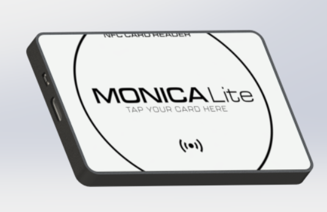
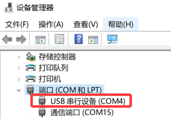
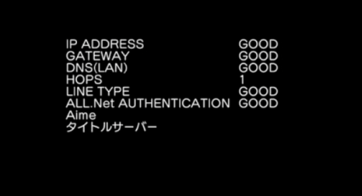

# Monica-Lite读卡器使用教程（二合一）

## 读卡器基本介绍与使用说明

### 硬件概述

**主控芯片：** 本读卡器采用 **STM32F072** 作为主控芯片。

与市面上常见的 **PN532** 不同，本产品使用了意法半导体公司生产的 **ST25R3911** NFC 芯片，拥有更强的读卡距离与抗干扰性能。

**版本说明：**

Monica 家族目前包括以下三个版本：

- **Monica Lite**：基础版本，不含灯光。
- **Monica 标准版：**带LED，标准版外壳。
- **Monica Pro：**带LED，铝合金外壳。

**通信接口：**

主控与 PC 之间通过 **USB CDC** 端口通信，**不受实际波特率影响**。

**外壳材质：**

采用哑光 PETG 材料 3D 打印，兼具美观与耐磨性。

### 基础连接步骤

!!! note "注意"
    无论游玩哪款游戏都先需要按照这个步骤进行

1. 使用 **Type-C 数据线** 连接读卡器与电脑。
2. 打开 **设备管理器**，在 **“端口 (COM 和 LPT)”** 分类下能看到 **“USB 串行设备”**。
3. 若未显示此设备，请尝试：
    - 更换 Type-C 数据线；
    - 或更换 USB 接口。

### SEGA 系游戏设置指南

<aside>
💡 本产品仅支持纯净包，如果你使用了munet的懒人包，请往下翻阅常见问题

</aside>

#### 设置端口号
    
    在设备管理器中右键点击 “**USB 串行设备**”，依次选择：
    
    **属性 → 端口设置 → 高级**，即可修改端口号。
    
    请根据下表选择对应端口号：
    

<aside>
❗ 注意注意：如果端口中有其它设备占用了读卡器的端口号，请将该设备的端口号设置成其他数字。
</aside>

| 游戏 | 读卡器端口号 | 默认波特率 | 备注 |
| --- | --- | --- | --- |
| ONGEKI, maimaiDX | COM1 | 高 |  |
| maimai FiNALE（旧框）
 | COM2 | 低 | 不支持AIC卡 |
| CHUNITHM | COM4 | 低（cvt），高（sp） |  |
| Project DIVA, Initial D | COM10 | 低 |  |

<aside>
💡 Chunithm的CVT即60HZ模式，对应旧框体。SP模式对应120HZ，新框体。

</aside>

#### 修改 segatools.ini

在游戏文件夹中找到 **`segatools.ini`** 文件并编辑：

① 在 `[aimeio]` 部分：

- 本读卡器采用串口直连方式，不需 AIMEIO 模块。
- 可将该段内容删除，或在 `path` 前加分号注释。

② 在 `[aime]` 部分：

- 将 `enable=1` 修改为 `enable=0`。

③ **保存修改**（Ctrl + S），退出文件。

④ 启动游戏后即可正常使用读卡器。

<aside>
💡 如果无法刷卡请重启电脑再试

</aside>

### KONAMI 系游戏设置指南

<aside>
💡 理论上支持通过spice启动的所有konami音游，包含SDVX、IIDX、Jubeat、Gitadora、Pop’n MUSIC等音游。

</aside>

#### 设备管理器设置
    
    参照前文 SEGA 游戏部分的设置步骤。
    
    唯一区别是：**只需确保端口号不与其他设备冲突**，无需特定编号。
    
#### Spice 设置
    
    打开游戏目录下的 **`spicecfg.exe`**，在 “Advanced” 选项卡中：
    
    - 启用 **“CardIO HID Reader Support”**。
    - 保存设置后即可使用。

### 常见问题

#### q：为什么SDEZ（舞萌）按照教程操作也无法识别读卡器？

   a：使用懒人包导致的，将最底下的压缩包解压即可。

#### q：为什么会出现卡在aime check的情况？

    a：munet的aimedb问题，在segatools.ini中注释掉aimedb一项即可，修改完之后必须重启电脑

